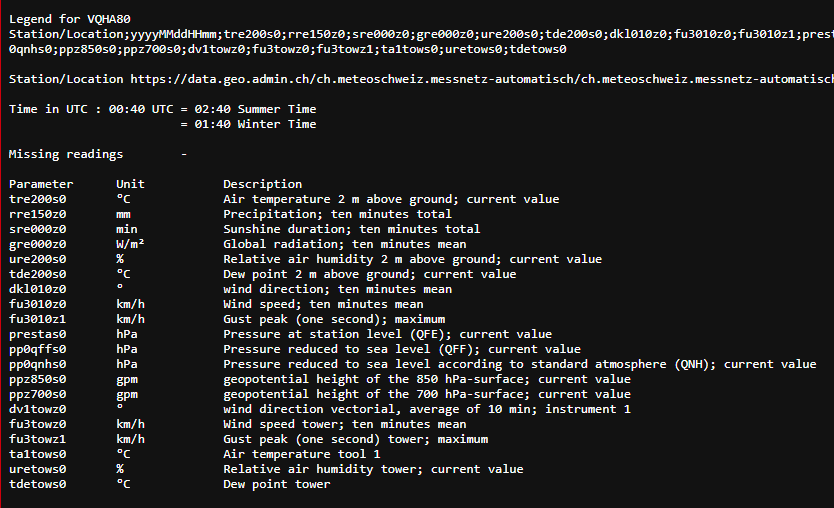
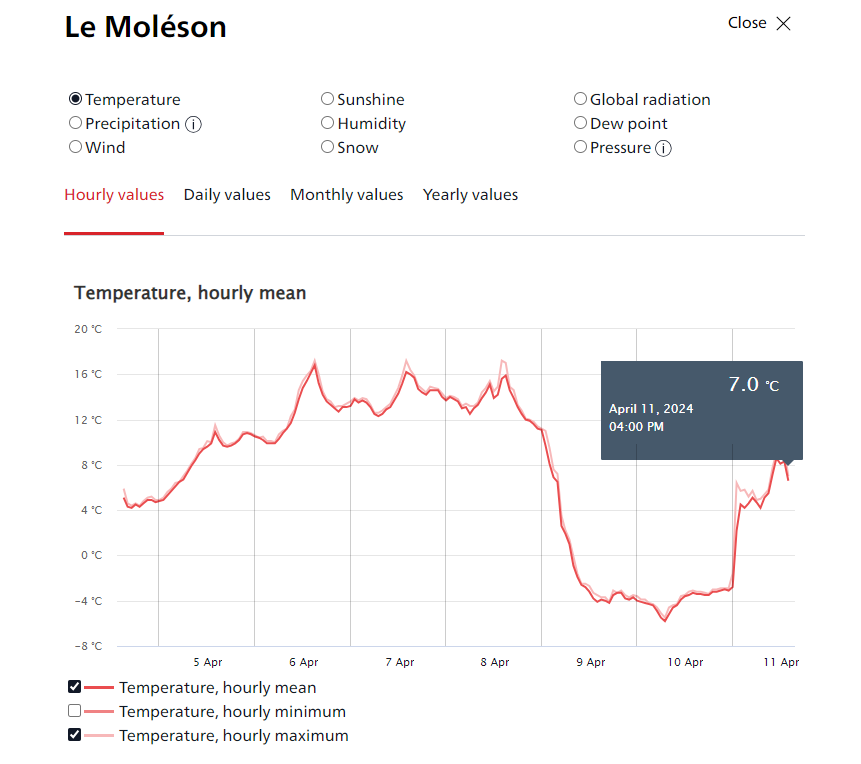

## TASK 1: EXPLORE METEOSWISS DATA

> Deliverables:
> For the two data products copy the URLs where the data can be downloaded in the report.
https://data.geo.admin.ch/ch.meteoschweiz.messnetz-automatisch/ch.meteoschweiz.messnetz-automatisch_en.json
https://data.geo.admin.ch/ch.meteoschweiz.messwerte-aktuell/VQHA80.csv  

> Document your exploration of the measurement values.

´´´text
TODO
´´´

> What is your impression of the the opendata.swiss portal and of MeteoSwiss' data products?

´´´text
TODO
pretty website ;-)

´´´

## TASK 2: UPLOAD THE CURRENT MEASUREMENT DATA TO S3 AND RUN SQL QUERIES ON IT

## TASK 6: TRANSFORM THE WEATHER STATIONS FILE INTO A CSV FILE

### 3: 
$ cat ch.meteoschweiz.messnetz-automatisch_en.json | yq -P . - > yaml.out

### 4:
$ cat ch.meteoschweiz.messnetz-automatisch_en.json | jq '.crs'
$ cat ch.meteoschweiz.messnetz-automatisch_en.json | jq '.features'

the features key
### 5:
$ cat ch.meteoschweiz.messnetz-automatisch_en.json | jq '.features|.[]'

### 6:

$ cat ch.meteoschweiz.messnetz-automatisch_en.json | jq '.features|.[]|.id' > ids.out

