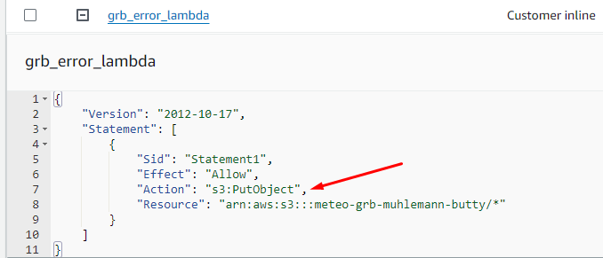
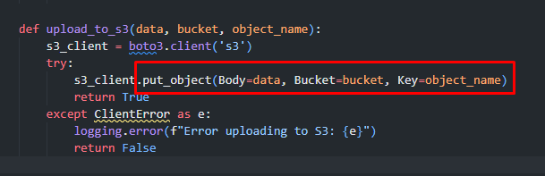

<div style="page-break-after: always; break-after: page;"></div>


## TASK 1: EXPLORE METEOSWISS DATA


> Deliverables:
> For the two data products copy the URLs where the data can be downloaded in the report.
https://data.geo.admin.ch/ch.meteoschweiz.messnetz-automatisch/ch.meteoschweiz.messnetz-automatisch_en.json
https://data.geo.admin.ch/ch.meteoschweiz.messwerte-aktuell/VQHA80.csv  

> Document your exploration of the measurement values.


´´´text
TODO
´´´


> What is your impression of the the opendata.swiss portal and of MeteoSwiss' data products?


´´´text
TODO
pretty website ;-)

´´´


## TASK 2: UPLOAD THE CURRENT MEASUREMENT DATA TO S3 AND RUN SQL QUERIES ON IT


## TASK 3: WRITE A PYTHON SCRIPT TO DOWNLOAD THE CURRENT MEASUREMENT VALUES FROM METEOSWISS AND UPLOAD THEM TO S3
```python

import boto3
import requests
import logging
from datetime import datetime
from botocore.exceptions import ClientError
from io import StringIO  # Needed to convert text to a file-like object for pandas

def lambda_handler(event, context):
    def download(url):
        try:
            r = requests.get(url)
            r.raise_for_status()  # Raise an exception for HTTP errors
            return r.text
        except requests.exceptions.RequestException as e:
            logging.error(f"Error downloading data: {e}")
            return None
    
    def upload_to_s3(data, bucket, object_name):
        s3_client = boto3.client('s3')
        try:
            s3_client.put_object(Body=data, Bucket=bucket, Key=object_name)
            return True
        except ClientError as e:
            logging.error(f"Error uploading to S3: {e}")
            return False

    data_url = "https://data.geo.admin.ch/ch.meteoschweiz.messwerte-aktuell/VQHA80.csv"
    raw_data = download(data_url)
    
    if raw_data is None:
        return {
            "statusCode": 500,
            "body": "Failed to download data"
        }


    timestamp = datetime.utcnow().replace(microsecond=0).isoformat()
    bucket_name = "meteo-grb-muhlemann-butty"
    object_name_with_timestamp = f"current/VQHA80-{timestamp}.csv"

    if upload_to_s3(raw_data, bucket_name, object_name_with_timestamp):
        return {
            "statusCode": 200,
            "body": f"File successfully uploaded to S3 bucket: {bucket_name} with filename {object_name_with_timestamp}"
        }
    else:
        return {
            "statusCode": 500,
            "body": "Failed to upload file to S3 bucket"
        }


```

## TASK 6: TRANSFORM THE WEATHER STATIONS FILE INTO A CSV FILE


### 3: 
$ cat ch.meteoschweiz.messnetz-automatisch_en.json | yq -P . - > yaml.out


### 4:
$ cat ch.meteoschweiz.messnetz-automatisch_en.json | jq '.crs'
$ cat ch.meteoschweiz.messnetz-automatisch_en.json | jq '.features'

the features key
### 5:
$ cat ch.meteoschweiz.messnetz-automatisch_en.json | jq '.features|.[]'


### 6:

$ cat ch.meteoschweiz.messnetz-automatisch_en.json | jq '.features|.[]|.id' > ids.out

### 7:

$ cat ch.meteoschweiz.messnetz-automatisch_en.json | jq '.features|.[]|.properties.station_name' > name.out

### 8:

$ cat ch.meteoschweiz.messnetz-automatisch_en.json | jq '.features|.[]|.properties.station_name,.id' > name_id.out

### 9:

$ cat ch.meteoschweiz.messnetz-automatisch_en.json | jq -j '.features|.[]|.properties.station_name,.id' > name_id_no_CR.out

### 10:
$ cat ch.meteoschweiz.messnetz-automatisch_en.json | jq -j '.features|.[]|.id, ",", .properties.station_name' > name_id_no_CR.out

### 11:

$ cat ch.meteoschweiz.messnetz-automatisch_en.json | jq -j '.features|.[]|.id, ",", "\"", .properties.station_name, "\""' > name_id_no_CR.out


###12:

$ cat ch.meteoschweiz.messnetz-automatisch_en.json | jq -j '.features|.[]|.id, ",", "\"", .properties.station_name, "\"", .properties.altitude, ",", .geometry.coordinates[0], ",", .geometry.coordinates[1], "\n" ' > altitude_coordinates.out

###13:
$ echo "id,station_name,altitude,coord_lng,coord_lat" > altitude_coordinates.csv
$ cat ch.meteoschweiz.messnetz-automatisch_en.json | jq -j '.features|.[]|.id, ",", "\"", .properties.station_name, "\"", .properties.altitude, ",", .geometry.coordinates[0], ",", .geometry.coordinates[1], "\n" ' > altitude_coordinates.csv

## TASK 7:


TODO checker athena


## TASK 8:

on a du ajouter une policy sur le bucket car nous utilisons 'putObject' dans la lambda



```python
import boto3
import requests
import logging
from datetime import datetime, timezone
import boto3
import io
import csv

def lambda_handler(event, context):
    def download(url):
        try:
            response = requests.get(url)
            response.raise_for_status()  # Ensure valid HTTP response
            return response
        except requests.exceptions.RequestException as e:
            logging.error(f"Error downloading data: {e}")
            return None
    
    def upload_to_s3(data, bucket, object_name):
        s3_client = boto3.client('s3')
        try:
            s3_client.put_object(Body=data, Bucket=bucket, Key=object_name)
            return True
        except ClientError as e:
            logging.error(f"Error uploading to S3: {e}")
            return False


    data_url = "https://data.geo.admin.ch/ch.meteoschweiz.messwerte-aktuell/VQHA80.csv"
    data = download(data_url)
    #If no data return error
    if data is None:
        return {
        "statusCode": 500,
        "body": "Failed to download data"
    }

    new_column_names = [
    "station", "year", "month", "day", "hour", "minute", 
    "temperature", "precipitation", "sunshine", "radiation", "humidity", 
    "dew_point", "wind_dir", "wind_speed", "gust_peak", "pressure", 
    "press_sea", "press_sea_qnh", "height_850_hpa", "height_700_hpa", 
    "wind_dir_vec", "wind_speed_tower", "gust_peak_tower", "temp_tool1", 
    "humidity_tower", "dew_point_tower"
    ]
    content = io.StringIO(data.content.decode('utf-8'))
    r = csv.DictReader(content, delimiter=";")

    processed_csv = io.StringIO()
    w = csv.DictWriter(processed_csv, new_column_names)
    w.writeheader()

    for row in r:
        current_row = {}
        for i, raw_date in enumerate(row.values()):

            if i == 1:
                timestamp = datetime.strptime(str(raw_date), "%Y%m%d%H%M")
                timestamp.replace(tzinfo=timezone.utc)
                current_row.update({"year": timestamp.year, "month": timestamp.month,
                                   "day": timestamp.day, "hour": timestamp.hour,
                                    "minute": timestamp.minute })
            else:
                # has to jump to +4 if the time columns haven been processed
                write_idx = i if i < 1 else i + 4
                current_row.update({new_column_names[write_idx]: raw_date})
        w.writerow(current_row)


    bucket_name = "meteo-grb-muhlemann-butty"
    object_name_with_timestamp = f"current/VQHA80-{timestamp}.csv"

    # Upload the CSV to S3
    if upload_to_s3(processed_csv.getvalue(), bucket_name, object_name_with_timestamp):
        return {
            "statusCode": 200,
            "body": f"File successfully uploaded to S3 bucket: {bucket_name} with filename {object_name_with_timestamp}"
        }
    else:
        return {
            "statusCode": 500,
            "body": "Failed to upload file to S3"
        }

```