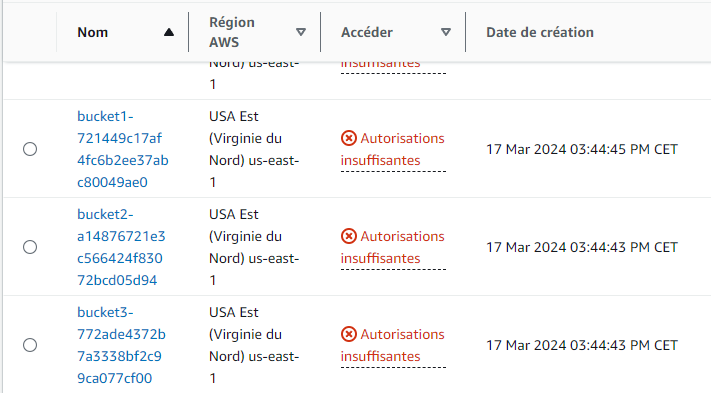

<div style="page-break-after: always; break-after: page;"></div>

## TASK 1: ACCESSING THE CONSOLE AS AN IAM USER

> 3. Attempt some actions in the Amazon EC2 console

As expected with this task, we don't have enough permissions for the actions we're attempting when we're connected as the devuser. However, we noticed the following: Even though we don't have access to the actions in the buckets, we can still see their contents, even though the documents themselves are inaccessible.




## TASK 2: ANALYZING THE IDENTITY-BASED POLICY APPLIED TO THE IAM USER

> 2. Review the IAM policy details

The IAM policy is the following :

```json
{
    "Statement": [
        {
            "Action": [
                "sts:AssumeRole",
                "s3:PutBucketPublicAccessBlock",
                "s3:PutBucketOwnershipControls",
                "s3:PutAccountPublicAccessBlock",
                "s3:ListBucket",
                "s3:ListAllMyBuckets",
                "s3:CreateBucket",
                "logs:List*",
                "logs:Get*",
                "logs:Desc*",
                "iam:List*",
                "iam:GetUserPolicy",
                "iam:GetUser",
                "iam:GetRolePolicy",
                "iam:GetRole",
                "iam:GetPolicyVersion",
                "iam:GetPolicy",
                "iam:GetGroupPolicy",
                "iam:GetGroup",
                "iam:GetAccountAuthorizationDetails",
                "iam:Describe*",
                "cloudformation:List*",
                "cloudformation:Get*",
                "cloudformation:Describe*"
            ],
            "Effect": "Allow",
            "Resource": "*"
        }
    ],
    "Version": "2012-10-17"
}
```

As announced, the policy does not allow Amazon EC2 actions. Amazon S3 object-related actions are also not allowed.


## TASK 3: ATTEMPTING WRITE-LEVEL ACCESS TO AWS SERVICES

> 1. Attempt to create an S3 bucket

As requested, we tried to create an S3 bucket. We were able to do this successfully, although we couldn't use the default encryption.


> 2. Access the bucket, and attempt to upload an object. A message displays *Upload failed*

We then tried to upload an item to the newly created bucket. Unsurprisingly, we couldn't :


> 3. Review the policy details to understand why you were able to create an S3 bucket but couldn’t upload objects to it.

Looking at the IAM policy, we see the following information: 

- `"Effect": "Allow"` : Specifies that access is allowed for the actions specified in the `Action' section.
- `"Resource": "*"` : Specifies the AWS resources on which authorized actions can be performed. `"*"` indicates that the permissions apply to all resources in the AWS account.
- The `Action` section is is a list of AWS actions, associated with a specific AWS service, that we are authorized to perform. 

Note that the `s3:CreateBucket` action is part of the list of actions. This allowed us to create our bucket. However, the `s3:PutObject` action, which allows uploading to the bucket, is not present, so we couldn't upload our file.


## TASK 4: ASSUMING AN IAM ROLE AND REVIEWING A RESOURCE-BASED POLICY

> 1. Try to download an object from the buckets that were created during lab setup

When we try to download an object from bucket1 or bucket2, we get an error page with the following informations :

```
This XML file does not appear to have any style information associated with it. The document tree is shown below.
----------------------------------------------------------------------------------------
<Error>
<Code>AccessDenied</Code>
<Message>Access Denied</Message>
<RequestId>TZPQQQTS4V2MTA85</RequestId>
<HostId>gLMcYF5sYGlx2qL0VfyGRoTuM+XF7C/mIS45uQM4b/tKc2KBQkdubGDkXkJWsukAlv6BMsrYv4I=</HostId>
</Error>
```


> 2. Assume the *BucketsAccessRole* IAM role in the console

We can check that we correctly switch by looking at the upper-right corner of the console and see :


> 3. Try to download an object from Amazon S3 again

Now we can download the image from bucket1, which is the following :


> 4. Test IAM access with the *BucketsAccessRole*

Once we switched for the `BucketsAccessRole`  IAM role, we can see that we no longer can see the user group informations :


> 5. Assume the *devuser* role again, and test access to the user groups page

After switching back to the devuser role, we can see the user group page again.


> 6. Analyze the IAM policy that is associated with the *BucketsAccessRole*

`ListAllBucketsPolicy` policy :

```json
{
    "Statement": [
        {
            "Action": "s3:ListAllMyBuckets",
            "Effect": "Allow",
            "Resource": "*"
        }
    ],
    "Version": "2012-10-17"
}
```

> This policy grants the same *s3:ListAllMyBuckets* action to every resource. This permission allows you to see all S3 buckets when you assume *BucketsAccessRole*.


`GrantBucket1Access` policy :

```json
{
    "Statement": [
        {
            "Action": [
                "s3:ListBucket",
                "s3:GetObject"
            ],
            "Effect": "Allow",
            "Resource": [
                "arn:aws:s3:::bucket1-721449c17af4fc6b2ee37abc80049ae0/*",
                "arn:aws:s3:::bucket1-721449c17af4fc6b2ee37abc80049ae0"
            ]
        }
    ],
    "Version": "2012-10-17"
}
```

> This policy allows the *s3:GetObject*, *s3:ListObjects*, and *s3:ListBucket* actions. Notice that this policy does *not* grant *s3:PutObject* access. The allowed actions are only granted for specific resources, *bucket1* and all objects within *bucket1* (as indicated by **/\***). The asterisk (*) is a wildcard character, which indicates that this would match any value.
>
> Because of this policy, when you assumed the *BucketsAccessRole*, you could see and download objects from *bucket1*.


> 8. Complete your analysis of the *BucketsAccessRole* details

If we go to the Trust relationship tab, we cas see the following configuration :

```json
{
    "Version": "2012-10-17",
    "Statement": [
        {
            "Sid": "Statement1",
            "Effect": "Allow",
            "Principal": {
                "AWS": [
                    "arn:aws:iam::851725581851:user/devuser1",
                    "arn:aws:iam::851725581851:user/devuser2",
                    "arn:aws:iam::851725581851:user/devuser3"
                ]
            },
            "Action": "sts:AssumeRole"
        }
    ]
}
```

This policy allows the listed AWS user to assume the BucketsAccessRole role. We can see that our devuser is in the list of trusted entities that can assume this role. We can also see that the number in Trusted Entities is the same as the account number, without the hyphens:


> 9. Assume the *BucketsAccessRole*, and try to upload an image to *bucket2*


The policies attached to the `BucketsAccessRole' role only grant us access to `Bucket1', but not to `Bucket2'. The reason for this will be discussed in the next task.


## TASK 5: UNDERSTANDING RESOURCE-BASED POLICIES

> 1. Observe the details of the bucket policy that is applied to *bucket2*

The bucket policy is the following : 

```json
{
    "Version": "2012-10-17",
    "Statement": [
        {
            "Sid": "S3Write",
            "Effect": "Allow",
            "Principal": {
                "AWS": "arn:aws:iam::851725581851:role/BucketsAccessRole"
            },
            "Action": [
                "s3:PutObject",
                "s3:GetObject"
            ],
            "Resource": "arn:aws:s3:::bucket2-a14876721e3c566424f83072bcd05d94/*"
        },
        {
            "Sid": "ListBucket",
            "Effect": "Allow",
            "Principal": {
                "AWS": "arn:aws:iam::851725581851:role/BucketsAccessRole"
            },
            "Action": "s3:ListBucket",
            "Resource": "arn:aws:s3:::bucket2-a14876721e3c566424f83072bcd05d94"
        }
    ]
}
```

> The policy has two statements.
>
> The first statement ID (SID) is *S3Write*. The principal is the *BucketsAccessRole* IAM role that you assumed. This role is allowed to call the actions *s3:GetObject* and *s3:PutObject* on the resource, which is *bucket2*.
>
> The second SID is *ListBucket*. The principal is *BucketsAccessRole*. This role is allowed to call the action *s3:ListBucket* on the resource, which is *bucket2*.

> In this lab, the *role-based policies* attached to the *BucketsAccessRole* IAM role granted *s3:GetObject* and *s3:ListBucket* access to *bucket1* and the objects in it. These role-based policies did not explicitly allow access to *bucket2*; however, they also did not explicitly deny access.

This task allows us to understand how resource-based policies and role-based policies can interact and be used together. As long as an action is not explicitly denied, other policies can give us access to it.


## TASK 6: FIND A WAY TO UPLOAD AN OBJECT TO *BUCKET3*

> 1. Try to upload the file as *devuser* with no role assumed.
>
>    Attempt to upload Image2.jpg, which you downloaded from *bucket1* earlier in this lab, to *bucket3.*

As devuser, we could not upload an image to `bucket3` and we could not see the bucker policy either.


> 2. Assume the *BucketsAccessRole*, and try the actions from the previous step

Even with `BucketsAccessRole`, we could not upload the image. But this time, we could see the policy, which is the following one :

```json
{
    "Version": "2012-10-17",
    "Statement": [
        {
            "Sid": "S3Write",
            "Effect": "Allow",
            "Principal": {
                "AWS": "arn:aws:iam::851725581851:role/OtherBucketAccessRole"
            },
            "Action": [
                "s3:PutObject",
                "s3:GetObject"
            ],
            "Resource": "arn:aws:s3:::bucket3-772ade4372b7a3338bf2c99ca077cf00/*"
        },
        {
            "Sid": "ListBucket",
            "Effect": "Allow",
            "Principal": {
                "AWS": "arn:aws:iam::851725581851:role/OtherBucketAccessRole"
            },
            "Action": "s3:ListBucket",
            "Resource": "arn:aws:s3:::bucket3-772ade4372b7a3338bf2c99ca077cf00"
        }
    ]
}
```

We can see from this policy that only the `OtherBucketAccessRole` role has access to upload and download actions on `bucket3`. If we still want to upload our image to `bucket3`, we need to assume the `OtherBucketAccessRole` role.


## TASK 7: DESIGN AND IMPLEMENT PERMISSION POLICIES FOR S3

> In this task we assume you are working for the company Acme Data Products, a startup offering data analysis services. You will create IAM roles and IAM policies to manage the access to the data.

> The data Acme stores in AWS falls into one of three categories:
>
> - *internal:* Data that has been gathered from various places, some of it can be a copy of public data, that has not yet been processed and therefore does not have particular value and does not need particular protection, but Acme does not want this data to be publicly accessible. All Acme employees can access this data, but no outsider.
> - *private:* This category contains data that either needs to be protected because of regulations, for example personal data that falls under GDPR, or because it is the result of Acme’s proprietary analysis algorithms and Machine Learning models and therefore valuable. Only certain Acme employees with “need to know” can access this data.
> - *public:* This is data that Acme wants to make publicly available, for example for marketing purposes. Everyone can access this data.

As asked, we created a bucket with the three folders for internal, private, and public data :


We then created the `AcmeGrBStaff`, `AcmeGrBDataScientist`  and `AcmeGrBDataIngester` roles. Next step was to create the customer-managed policies and attach them to the roles :

- `AcmeDataGrBReadAccess` : Policy used by the `AcmeGrBStaff` role. Allow read access to internal and public data.

  ```json
  {
      "Version": "2012-10-17",
      "Statement": [
          {
              "Sid": "ListObjectsInBucket",
              "Effect": "Allow",
              "Action": [
                  "s3:ListBucket"
              ],
              "Resource": [
  				"arn:aws:s3:::acmedata-grb"
  			]
          },
          {
              "Sid": "ObjectReadAccess",
              "Effect": "Allow",
              "Action": [
                  "s3:GetObject"
              ],
              "Resource": [
  				"arn:aws:s3:::acmedata-grb/internal/*",
                  "arn:aws:s3:::acmedata-grb/public/*"
  			]
          }
      ]
  }
  ```

  

- `AcmeDataGrBFullAccess` : Policy used by the `AcmeGrBDataScientist` role. Allow read and write access to all data.

  ```json
  {
      "Version": "2012-10-17",
      "Statement": [
          {
              "Sid": "ListObjectsInBucket",
              "Effect": "Allow",
              "Action": [
                  "s3:ListBucket"
              ],
              "Resource": [
  				"arn:aws:s3:::acmedata-grb"
  			]
          },
          {
              "Sid": "AllObjectActions",
              "Effect": "Allow",
              "Action": [
                  "s3:*Object"
              ],
              "Resource": [
  				"arn:aws:s3:::acmedata-grb/*"
  			]
          }
      ]
  }
  ```

  

- `AcmeDataGrBWriteAccess` : Policy used by the `AcmeGrBDataIngester` role. Allow write access to internal and private data.

  ```json
  {
      "Version": "2012-10-17",
      "Statement": [
          {
              "Sid": "ListObjectsInBucket",
              "Effect": "Allow",
              "Action": [
                  "s3:ListBucket"
              ],
              "Resource": [
  				"arn:aws:s3:::acmedata-grb"
  			]
          },
  		{
              "Sid": "ObjectWriteAccess",
  			"Action": [
                  "s3:DeleteObject",
  				"s3:PutObject"
  			],
  			"Resource": [
  				"arn:aws:s3:::acmedata-grb/internal/*",
  				"arn:aws:s3:::acmedata-grb/private/*"
  			],
  			"Effect": "Allow"
  		}
  	]
  }
  ```


Note that we decided to include only the object actions, even if other useful actions exist (for example, with tags or versions), because we applied the principle of least privilege.

We then needed to set up a policy that would allow anyone to read the public data. To do this, we used a bucket policy :

```json
{
    "Version": "2012-10-17",
    "Statement": [
        {
            "Sid": "ListObjectsInBucket",
            "Effect": "Allow",
            "Principal": "*",
            "Action": "s3:ListBucket",
            "Resource": "arn:aws:s3:::acmedata-grb",
            "Condition": {
                "StringEquals": {
                    "s3:prefix": "public/",
                    "s3:delimiter": "/"
                }
            }
        },
        {
            "Sid": "ObjectReadAccess",
            "Effect": "Allow",
            "Principal": "*",
            "Action": "s3:GetObject",
            "Resource": "arn:aws:s3:::acmedata-grb/public/*"
        }
    ]
}
```

We used the `contition` parameter to specify that only the contents of the public folder could be listed.


## TASK 8: SIMULATING POLICY EVALUATION

> In this task you will use a policy simulator provided by AWS to test policies.
>
> - The policy simulator is available at https://policysim.aws.amazon.com/.
> - Documentation is available at [Testing IAM policies with the IAM policy simulator](https://docs.aws.amazon.com/IAM/latest/UserGuide/access_policies_testing-policies.html).


We here are testing the `DeleteBucket` and `ListBucket` actions, with the `OtherBucketAccessRole` role. The IAM policy `GrantBucker1Access' is attached to this role, the content of which is displayed in task 4, item 6.

Not surprisingly, both are implicitly denied if we don't specify a bucket.


If we specify the resource as bucket1 (`arn:aws:s3:::bucket1-721449c17af4fc6b2ee37abc80049ae0`), we see that the `ListBucket` action is allowed by the `GrantBucker1Access` IAM policy, as shown below.


> Create a new policy, by copying and modifying the *GrantBucket1Access* policy, that explicitly *denies* access to a bucket. Using the *New Policy* mode of the simulator, create a request that will be *denied* explicitely.

The created policy is the following :

```json
{
    "Statement": [
        {
            "Action": [
                "s3:ListBucket"
            ],
            "Effect": "Deny",
            "Resource": [
                "arn:aws:s3:::bucket1-721449c17af4fc6b2ee37abc80049ae0"
            ]
        }
    ],
    "Version": "2012-10-17"
}
```

By running the simulations with this policy, we had the expected results: the `ListBucket' action was explicitly denied for our bucket1 :


