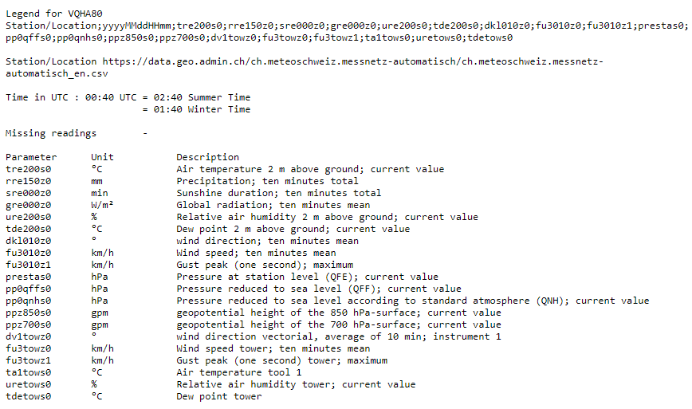
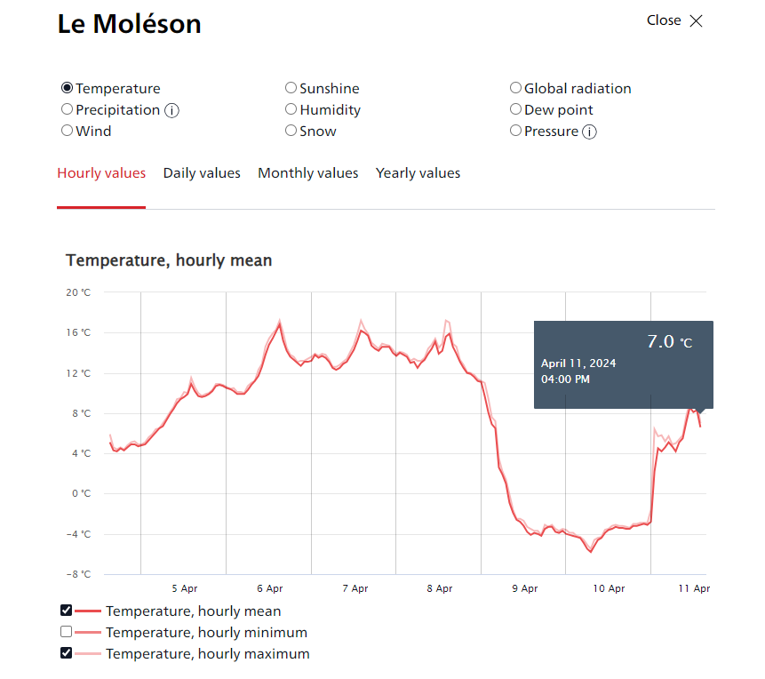
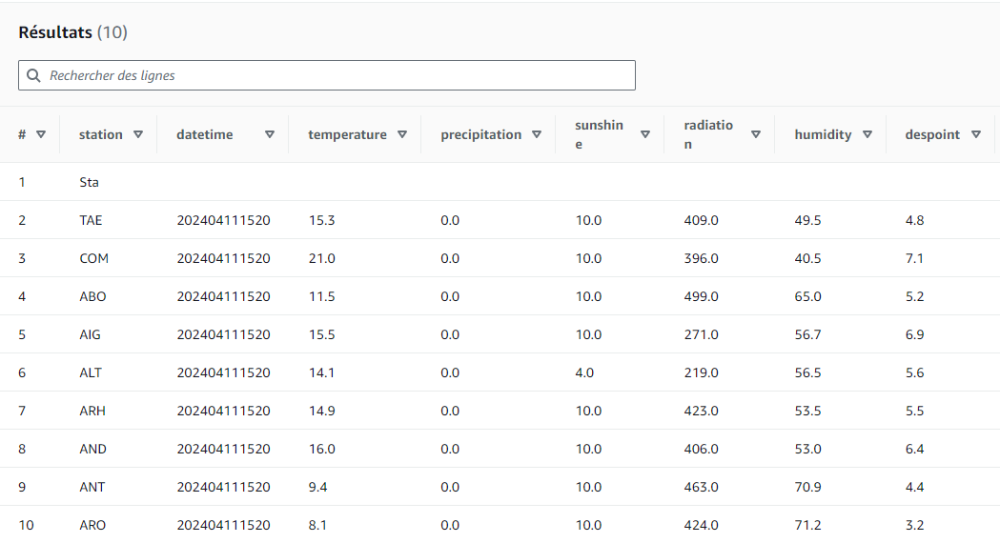
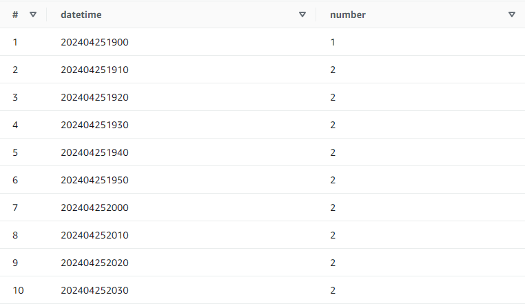
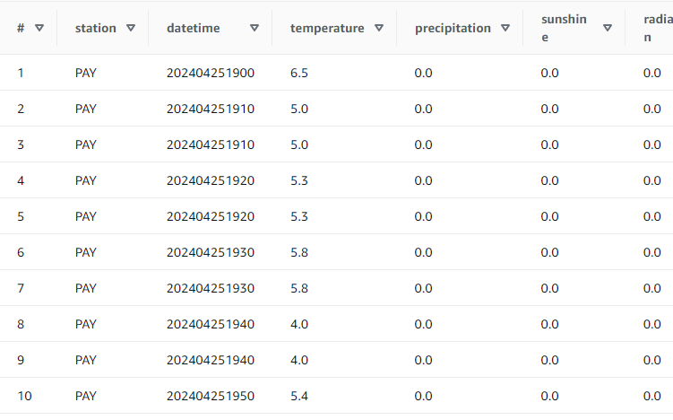
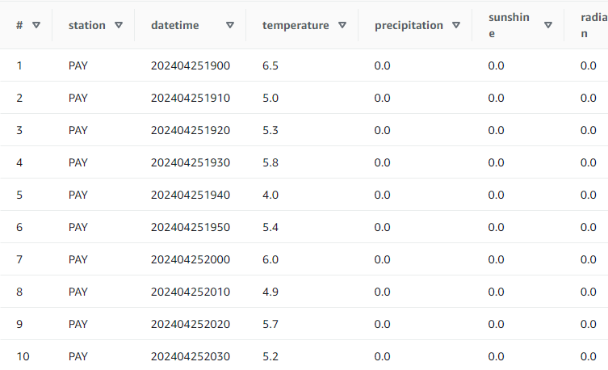
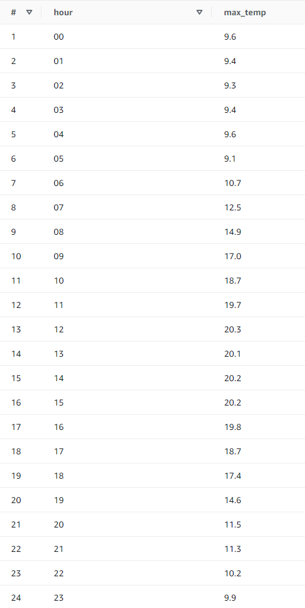
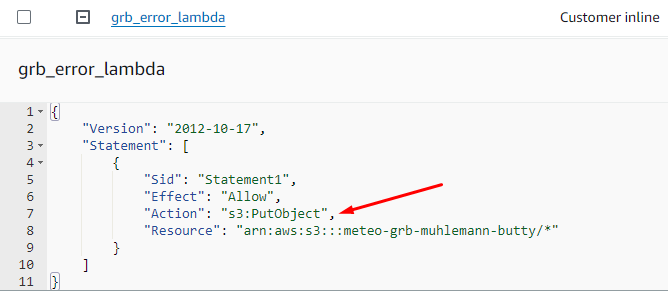

<div id='_export_cover' style="height:50vh">
  <div id='_export_title' style="margin-top: 50%;text-align: center;font-size: 1.5rem;">IST - Lab 05</div>
  <div id='_export_subject' style="text-align: center;font-size: 2rem;">SERVERLESS DATA INGESTION AND PROCESSING</div>
  <br><br><br><br>
  <div id='_export_author' style="text-align: center;font-size: 1rem;">L05GrB : Butty Vicky & Mühlemann Julien</div>
  <div id='_export_date' style="text-align: center;font-size: 1rem;">01.05.2024</div>
</div>
<script>
    var $cover = document.querySelector("#_export_cover");
    var title = document.querySelector("meta[name='title']").getAttribute("content");
    var subject = document.querySelector("meta[name='subject']").getAttribute("content");
    var author= document.querySelector("meta[name='author']").getAttribute("content");
    var group = document.querySelector("meta[name='group']").getAttribute("content");
    var date = document.querySelector("meta[name='date']").getAttribute("content");

<div style="page-break-after: always; break-after: page;"></div>

## TASK 1: EXPLORE METEOSWISS DATA 

> Deliverables:
>
> - For the two data products copy the URLs where the data can be downloaded in the report.

As requested, we searched for the meteorological data products from MeteoSwiss and found the two :

- "Automatic weather stations – Current measurement values"

  https://opendata.swiss/en/dataset/automatische-wetterstationen-aktuelle-messwerte

- "Weather stations of the automatic monitoring network"

  https://opendata.swiss/en/dataset/automatische-meteorologische-bodenmessstationen


> - Document your exploration of the measurement values.

We first looked at the explanations of the various fields, which can be found at https://data.geo.admin.ch/ch.meteoschweiz.messwerte-aktuell/info/VQHA80_en.txt :

We can see with this that the date is in the format `yyyyMMddHHmm`. Our file contains the date `202404111520`, which means that the data was collected on April 11, 2024 at 3:20 p.m. (UTC). So we have to add 2 hours to get the correct time for us in Switzerland.

We also compared the data from the file with the data shown on the MeteoSwiss website. We selected the station `MLS` which is `Le Moléson`. The announced temperature was 6.7°C and by checking the hourly average for this station on the website, we can see that we are in the right interval. We also checked with a the weather phone app and the value was close to the MeteoSwiss value.





> - What is your impression of the the opendata.swiss portal and of MeteoSwiss' data products?

The opendata.swiss portal is a good initiative to share data with the public. Several topics are covered, providing valuable resources for anyone interested in data collected in Switzerland. The site is relatively easy to use to find the information we're looking for, although sometimes we have to dig a little deeper to get it.

The MeteoSwiss site is also well constructed and provides all kinds of weather and climate information for Switzerland. The data is presented in a way that's easy to understand for someone outside the field. The data provided by MeteoSwiss on the opendata.swiss platform is a great help for anyone interested in the subject.


## TASK 2: UPLOAD THE CURRENT MEASUREMENT DATA TO S3 AND RUN SQL QUERIES ON IT

> 5. Create a table in the database from the uploaded data

We can manually create the request to create the database, using the request editor. But it's much easier to use the `S3 bucket data` option.  This will allow us to generate the following query without typing it completely :

```SQL
CREATE EXTERNAL TABLE IF NOT EXISTS `meteoswiss_grb`.`current` ( `station` varchar(3), `datetime` bigint, `temperature` float, `precipitation` float, `sunshine` float, `radiation` float, `humidity` float, `despoint` float, `wind_dir` float, `wind_speed` float, `gust_peak` float, `pressure` float, `press_sea` float, `press_sea_qnh` float, `height_850_hpa` float, `heigh_700_hpa` float, `wind_dir_vec` float, `wind_speed_tower` float, `gust_peak_tower` float, `temp_tool1` float, `humidity_tower` float, `dew_point_tower` float
)
ROW FORMAT SERDE 'org.apache.hadoop.hive.serde2.lazy.LazySimpleSerDe'
WITH SERDEPROPERTIES ('field.delim' = ';')
STORED AS INPUTFORMAT 'org.apache.hadoop.mapred.TextInputFormat' OUTPUTFORMAT 'org.apache.hadoop.hive.ql.io.HiveIgnoreKeyTextOutputFormat'
LOCATION 's3://meteo-grb-muhlemann-butty/current/'
TBLPROPERTIES ('classification' = 'csv')
```


> 6. Preview the content of the table

Since we selected the `Preview Table` option, a query is added to the query editor, allowing us to see the first ten rows of the table :




## TASK 3: WRITE A PYTHON SCRIPT TO DOWNLOAD THE CURRENT MEASUREMENT VALUES FROM METEOSWISS AND UPLOAD THEM TO S3

> Deliverables: Copy the script into the report.

To download the MeteoSwiss measurement and then upload it to S3, we created the following Python script. Note that we used a test bucket for this part.
```python
import requests
import logging
import boto3
import os
from botocore.exceptions import ClientError

def download(url):
    try:
        r = requests.get(url)
        r.raise_for_status()  # Raise an exception for HTTP errors
        return r.text
    except requests.exceptions.RequestException  as e:
        logging.error(f"Error downloading file: {e}")
        return None

def upload_to_s3(data, bucket, object_name):
    s3_client = boto3.client('s3')
    try:
        response = s3_client.put_object(Body=data, Bucket=bucket, Key=object_name)
    except ClientError as e:
        logging.error(e)
        return False
    return True

# Download CSV data
data = download("https://data.geo.admin.ch/ch.meteoschweiz.messwerte-aktuell/VQHA80.csv")
if data is None:
    print("Failed to download CSV data")
    exit()

# Upload data to S3 bucket
bucket_name = "ist-grb-muhlemann-test"
object_name = "VQHA80.csv"

if upload_to_s3(data, bucket_name, object_name):
    print("File uploaded successfully to S3 bucket:", bucket_name)
else:
    print("Failed to upload file to S3 bucket")
```


## TASK 4: CONVERT YOUR SCRIPT INTO AN AWS LAMBDA FUNCTION FOR DATA INGESTION

> Deliverables: Copy the data ingestion function and the IAM policy into the lab report.

- Data ingestion function :

```python
import boto3
import requests
import logging
from datetime import datetime
from botocore.exceptions import ClientError
from io import StringIO  # Needed to convert text to a file-like object for pandas

def lambda_handler(event, context):
    def download(url):
        try:
            r = requests.get(url)
            r.raise_for_status()  # Raise an exception for HTTP errors
            return r.text
        except requests.exceptions.RequestException as e:
            logging.error(f"Error downloading data: {e}")
            return None
    
    def upload_to_s3(data, bucket, object_name):
        s3_client = boto3.client('s3')
        try:
            s3_client.put_object(Body=data, Bucket=bucket, Key=object_name)
            return True
        except ClientError as e:
            logging.error(f"Error uploading to S3: {e}")
            return False

    data_url = "https://data.geo.admin.ch/ch.meteoschweiz.messwerte-aktuell/VQHA80.csv"
    raw_data = download(data_url)
    
    if raw_data is None:
        return {
            "statusCode": 500,
            "body": "Failed to download data"
        }


    timestamp = datetime.utcnow().replace(microsecond=0).isoformat()
    bucket_name = "meteo-grb-muhlemann-butty"
    object_name_with_timestamp = f"current/VQHA80-{timestamp}.csv"

    if upload_to_s3(raw_data, bucket_name, object_name_with_timestamp):
        return {
            "statusCode": 200,
            "body": f"File successfully uploaded to S3 bucket: {bucket_name} with filename {object_name_with_timestamp}"
        }
    else:
        return {
            "statusCode": 500,
            "body": "Failed to upload file to S3 bucket"
        }
```


- IAM Policy :

```json
{
    "Version": "2012-10-17",
    "Statement": [
        {
            "Sid": "WriteToS3Lambda",
            "Effect": "Allow",
            "Action": [
                "s3:PutObject"
            ],
            "Resource": [
                "arn:aws:s3:::meteo-grb-muhlemann-butty/*"
            ]
        }
    ]
}
```


## TASK 5: CREATE AN EVENT RULE THAT TRIGGERS YOUR FUNCTION EVERY 10 MINUTES

Although this task isn't that complicated, we ran into a big problem: our trigger seem to fire twice every ten minutes, doubling the number of reads. 

When querying the accumulated data for task 7, we noticed strange patterns in the data that allowed us to locate anomalous files. We then used the following query :

```SQL
SELECT datetime, count(*) as number
FROM current
WHERE station = 'PAY'
GROUP BY datetime
ORDER BY datetime ASC;
```



We tried restarting our trigger and changing our lambda function, but nothing helped.


## TASK 6: TRANSFORM THE WEATHER STATIONS FILE INTO A CSV FILE

>  Deliverables: Copy the final jq command into the report.

```bash
$ echo "id,station_name,altitude,coord_lng,coord_lat" > altitude_coordinates.csv
$ cat ch.meteoschweiz.messnetz-automatisch_en.json | jq -j '.features|.[]|.id, ",", "\"", .properties.station_name, "\",", .properties.altitude, ",", .geometry.coordinates[0], ",", .geometry.coordinates[1], "\n"' >> altitude_coordinates.csv
```


## TASK 7: QUERY THE ACCUMULATED DATA

> Deliverables: Copy the queries and query results into the report.

> 2. Using Amazon Athena, make a query that returns all measurements for the Payerne station (PAY), sorted by ascending datetime.

Query :

```SQL
SELECT *
FROM current
WHERE station = 'PAY'
ORDER BY datetime ASC;
```

Results :



Since we have the duplicate records error for each datetime, the values shown in the results are also duplicated. To avoid these duplicate records, we need to use the `GROUP BY` operator and use it on all columns.

Query :

```SQL
SELECT station, datetime, temperature, precipitation, sunshine, radiation, humidity, despoint, wind_dir, wind_speed, gust_peak, pressure, press_sea, press_sea_qnh, height_850_hpa, heigh_700_hpa, wind_dir_vec, wind_speed_tower, gust_peak_tower, temp_tool1, humidity_tower, dew_point_tower
FROM current
WHERE station = 'PAY'
GROUP BY station, datetime, temperature, precipitation, sunshine, radiation, humidity, despoint, wind_dir, wind_speed, gust_peak, pressure, press_sea, press_sea_qnh, height_850_hpa, heigh_700_hpa, wind_dir_vec, wind_speed_tower, gust_peak_tower, temp_tool1, humidity_tower, dew_point_tower
ORDER BY datetime ASC;
```

Results :




> 3. For Payerne, make a query that returns the maximum temperature for each hour, sorted by increasing hour.

Query :

```SQL
SELECT SUBSTR(CAST(datetime as varchar), 9, 2) as hour, MAX(temperature) as max_temp
FROM current
WHERE station = 'PAY'
GROUP BY SUBSTR(CAST(datetime as varchar), 9, 2) 
ORDER BY hour;
```

Note: This request is not affected by the duplicate records error. 

Results :




> 4. Find all stations whose altitude is similar to Yverdon, i.e. 400 m <= altitude < 500 m, sorted by altitude.

Query :

```SQL
SELECT *
FROM stations
WHERE altitude BETWEEN 400 AND 499 
ORDER BY altitude ASC;
```

We used the `BETWEEN` operator because it gives us a clearer view of the query. Since the limits are included in the selected values, we had to use 499 as the upper limit so that the value 500 would not be considered.

Results :

TODO


> 5. Find the maximum temperature of all stations at an altitude similar to Yverdon, sorted by altitude.

Query :

```SQL
SELECT c.station, s.altitude, MAX(c.temp) as max_temp
FROM current c
JOIN stations s ON c.station = s.id
WHERE s.altitude BETWEEN 400 and 499
GROUP BY c.station, s.altitude ORDER BY s.altitude;
```

We used the `BETWEEN` operator again. For the same reason as before, we used 499 as the upper limit.

Results :

TODO


## TASK 8: WRITE AN S3 OBJECT LAMBDA FUNCTION TO TRANSFORM DATA

> Deliverable: Copy the code of your function into the report and document your tests.

```python
import boto3
import requests
import logging
from datetime import datetime, timezone
import io
import csv

def lambda_handler(event, context):
    def download(url):
        try:
            response = requests.get(url)
            response.raise_for_status()  # Ensure valid HTTP response
            return response
        except requests.exceptions.RequestException as e:
            logging.error(f"Error downloading data: {e}")
            return None
    
    def upload_to_s3(data, bucket, object_name):
        s3_client = boto3.client('s3')
        try:
            s3_client.put_object(Body=data, Bucket=bucket, Key=object_name)
            return True
        except ClientError as e:
            logging.error(f"Error uploading to S3: {e}")
            return False


    data_url = "https://data.geo.admin.ch/ch.meteoschweiz.messwerte-aktuell/VQHA80.csv"
    data = download(data_url)
    #If no data return error
    if data is None:
        return {
        "statusCode": 500,
        "body": "Failed to download data"
    }

    new_column_names = [
    "station", "year", "month", "day", "hour", "minute", 
    "temperature", "precipitation", "sunshine", "radiation", "humidity", 
    "dew_point", "wind_dir", "wind_speed", "gust_peak", "pressure", 
    "press_sea", "press_sea_qnh", "height_850_hpa", "height_700_hpa", 
    "wind_dir_vec", "wind_speed_tower", "gust_peak_tower", "temp_tool1", 
    "humidity_tower", "dew_point_tower"
    ]
    content = io.StringIO(data.content.decode('utf-8'))
    r = csv.DictReader(content, delimiter=";")

    processed_csv = io.StringIO()
    w = csv.DictWriter(processed_csv, new_column_names)
    w.writeheader()

    for row in r:
        current_row = {}
        for i, raw_date in enumerate(row.values()):

            if i == 1:
                timestamp = datetime.strptime(str(raw_date), "%Y%m%d%H%M")
                timestamp.replace(tzinfo=timezone.utc)
                current_row.update({"year": timestamp.year, "month": timestamp.month,
                                   "day": timestamp.day, "hour": timestamp.hour,
                                    "minute": timestamp.minute })
            else:
                # has to jump to +4 if the time columns haven been processed
                write_idx = i if i < 1 else i + 4
                current_row.update({new_column_names[write_idx]: raw_date})
        w.writerow(current_row)


    bucket_name = "meteo-grb-muhlemann-butty"
    object_name_with_timestamp = f"current/VQHA80-{timestamp}.csv"

    # Upload the CSV to S3
    if upload_to_s3(processed_csv.getvalue(), bucket_name, object_name_with_timestamp):
        return {
            "statusCode": 200,
            "body": f"File successfully uploaded to S3 bucket: {bucket_name} with filename {object_name_with_timestamp}"
        }
    else:
        return {
            "statusCode": 500,
            "body": "Failed to upload file to S3"
        }

```


Since we used the 0`putObject` action in our lambda (in the `upload_to_s3` function), we had to add a new in-line policy for the bucket:



TODO : Document tests !

TODO : Should the new lambda replace the old one or should it complement it ? ( => download from S3 current > transform > upload on S3 "current_pretty" => Check grH )


## TASK 9: SCENARIO

> As an engineer working with data products, you might face unexpected issues with your application due to sudden modification of the source data. How could MeteoSwiss change the data product, and which modifications would you make to ensure that your code still functions correctly? How would you improve your code robustness for such changes? What can be done to detect schema changes in the source data?

MeteoSwiss may modify the data product in the following ways

- Data format changes: You can change to a different format for the data you provide.
- Attribute changes: You can rename some attributes, add new ones or remove existing ones.
- Interval changes: You can change the interval between two data files on opendata.
- URL changes: You can change the url used to retrieve the data from.


To ensure that our code still works correctly despite these changes, we can improve its robustness with

- Modularization : By breaking our code into modular components, we can easily handle different data formats without replacing the entire code. It also allows us to identify and update only the parts affected by changes in the data source.
- Data Abstraction: If we implement interfaces that prevent our code from being directly dependent on the source data schema, the data can change without affecting the rest of our code.
- Error Handling: Robust error handling will prevent us from catching unexpected changes in the data source, such as removed or renamed attributes.

- Testing: With tests covering different scenarios, including different versions of the data schema, we can quickly identify and fix problems caused by changes in the data source.
- Documentation and version control: By using version control of the code, we can track changes over time and roll them back if necessary. Documentation can also serve as a reference for future updates.


To detect schema changes in the source data, we can use the following strategies

- Schema validation: Implementing schema validation checks in the data ingestion process allows you to ensure that incoming data conforms to the expected schema before processing it further.
- Metadata comparison: Any changes in the metadata can indicate changes that need to be addressed.
- Change notifications: If opendata or MeteoSwiss provide change notifications or change logs, we could use them to be informed in advance about planned changes to the data schema.
- Monitoring: AWS's monitoring system could help us detect errors related to the data schema changes.
