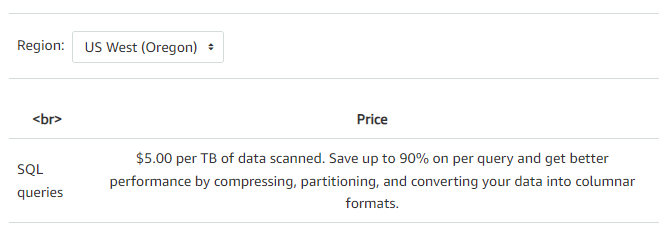
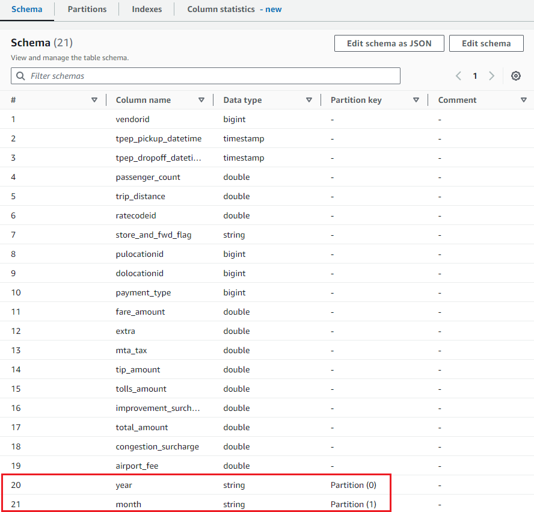
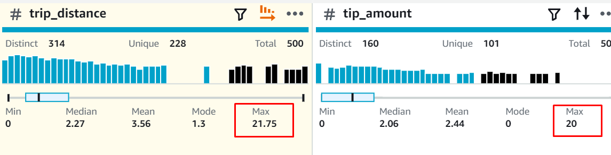

<div style="page-break-after: always; break-after: page;"></div>

## TASK 1: EXPLORE NEW YORK CITY TAXI TRIP DATA

> Deliverables:
>
> - Responses to questions. 
>
> 1. Navigate to the TLC Trip Record Data website. The taxi commission publishes data on four types of cabs. Which are they?

For each years since 2019, the taxi commission published the data on the following four types of cabs:

- Yellow Taxi Trip Records
- Green Taxi Trip Records
- For-Hire Vehicle Trip Records
- High Volume For-Hire Vehicle Trip Records


> 2. Find the PDF file with the *data dictionary* for the yellow cab data on web site. Does it contain the data types?

The [Data Dictionary - Yellow Taxi Trip Records](https://www.nyc.gov/assets/tlc/downloads/pdf/data_dictionary_trip_records_yellow.pdf) contains a table with the field names and a description. The description helps to understand the data, but doesn't explicitly include the data types.


> 3. The yellow cab data is available in what types of files?

As of 13.05.2022, the taxi commissions have switched to the PARQUET file type for storing raw trip data on their website. This format is the industry standard for working with big data and allows for reduced file sizes and increased speed.


> 4. Find the copy of the data product in the Registry of Open Data on AWS. What is the bucket name? In which region is the bucket? Open the bucket in the S3 console.

The data product is named [New York City Taxi and Limousine Commission (TLC) Trip Record Data](https://registry.opendata.aws/nyc-tlc-trip-records-pds/) in the Registry of Open Data on AWS. The data are stored in the `nyc-tlc` bucket, wich is hosted in the `us-east-1` AWS Region.

The bucket can be accessed via this link : https://us-east-1.console.aws.amazon.com/s3/buckets/nyc-tlc?region=us-east-1&bucketType=general&tab=objects


> 5. In this lab we are going to use the yellow cab trip data.
>    In which folder are the CSV files for yellow cabs? Does this folder only contain yellow cab data?
>    In which folder are the Parquet files for yellow cabs? Does this folder only contain yellow cab data?

The CSV files for yellow cab are located under the prefix [opendata_repo/opendata_webconvert/yellow/](https://us-east-1.console.aws.amazon.com/s3/buckets/nyc-tlc?region=us-east-1&bucketType=general&prefix=opendata_repo/opendata_webconvert/yellow/&showversions=false) for the year 2022 and under the prefix [csv_backup/](https://us-east-1.console.aws.amazon.com/s3/buckets/nyc-tlc?region=us-east-1&bucketType=general&prefix=csv_backup/&showversions=false) for the older versions. Note that there are two files appear in both paths.


> 6. Is Amazon's copy up-to-date compared to the original data product?

The Amazon copy is not up to date. The latest version of the file (CSV and Parquet) is from December 2022. The TLC Trip Record Data website has data through February 2024. Note that the Taxi publishes trip data monthly (with a two month delay).


## TASK 2: CREATE AN ENTRY IN THE DATA CATALOG AND QUERY THE DATA

> Deliverables: 
>
> - Responses to questions.
>
> 0. Explore the S3 folder `s3://aws-tc-largeobjects/CUR-TF-200-ACBDFO-1/Lab2/yellow/`.
>
>    What subset of the data does the folder contain? In what format?

After connecting to the bucket with this [link](https://us-west-2.console.aws.amazon.com/s3/buckets/aws-tc-largeobjects?region=us-west-2&bucketType=general&prefix=CUR-TF-200-ACBDFO-1/Lab2/yellow/&showversions=false), we could see the data contained in the folder. These are the data for the yellow taxi, from 2017, in csv files.


> 6. Write down the run time and the volume of data scanned.

We runned the query below, to display the first 10 rows

```sql
SELECT * FROM "taxidata_grj"."yellow" limit 10
```

Athena displayed the following values:

- Time in queue : 59ms
- Run time: 1.064 sec
- Data scanned: 1.69 MB


> 7. How much did the last query cost?

[Amazon Athena Pricing](https://aws.amazon.com/athena/pricing/) allow us to get the following informations about the price 



This means that our last query cost us: 
$$
\begin{align*} 
& 1.69 * 10^{-6} \text{ TB} * 5.00 \text{ \$/TB} = 8.45 * 10^{-6} \text{ \$}
\end{align*}
$$


> - In the Athena console display the DDL definition of the table and copy it into the report.

```sql
CREATE EXTERNAL TABLE IF NOT EXISTS `taxidata_grj`.`yellow` (
  `vendorid` int,
  `pickup` timestamp,
  `dropoff` timestamp,
  `passenger_count` float,
  `trip_distance` float,
  `ratecodeid` float,
  `store_and_fwd_flag` string,
  `pulocationid` int,
  `dolocationid` int,
  `payment_type` int,
  `fare_amount` float,
  `extra` float,
  `mta_tax` float,
  `tip_amount` float,
  `tolls_amount` float,
  `improvement_surcharge` float,
  `total_amount` float,
  `congestion_surcharge` float,
  `airport_fee` float
)
ROW FORMAT SERDE 'org.apache.hadoop.hive.serde2.lazy.LazySimpleSerDe'
WITH SERDEPROPERTIES ('field.delim' = ',')
STORED AS INPUTFORMAT 'org.apache.hadoop.mapred.TextInputFormat' OUTPUTFORMAT 'org.apache.hadoop.hive.ql.io.HiveIgnoreKeyTextOutputFormat'
LOCATION 's3://aws-tc-largeobjects/CUR-TF-200-ACBDFO-1/Lab2/yellow/'
TBLPROPERTIES ('classification' = 'csv');
```

<div style="page-break-after: always; break-after: page;"></div>

## TASK 3: OPTIMISE THE QUERY BY SCANNING ONLY A PARTITION OF THE DATA

> Deliverables:
>
> - In the Athena console display the DDL definition of the table and copy it into the report.

```sql
CREATE EXTERNAL TABLE IF NOT EXISTS `taxidata_grj`.`jan` (
  `vendorid` int,
  `pickup` timestamp,
  `dropoff` timestamp,
  `passenger_count` float,
  `trip_distance` float,
  `ratecodeid` float,
  `store_and_fwd_flag` string,
  `pulocationid` int,
  `dolocationid` int,
  `payment_type` int,
  `fare_amount` float,
  `extra` float,
  `mta_tax` float,
  `tip_amount` float,
  `tolls_amount` float,
  `improvement_surcharge` float,
  `total_amount` float,
  `congestion_surcharge` float,
  `airport_fee` float
)
ROW FORMAT SERDE 'org.apache.hadoop.hive.serde2.lazy.LazySimpleSerDe'
WITH SERDEPROPERTIES ('field.delim' = ',')
STORED AS INPUTFORMAT 'org.apache.hadoop.mapred.TextInputFormat' OUTPUTFORMAT 'org.apache.hadoop.hive.ql.io.HiveIgnoreKeyTextOutputFormat'
LOCATION 's3://aws-tc-largeobjects/CUR-TF-200-ACBDFO-1/Lab2/January2017/'
TBLPROPERTIES ('classification' = 'csv');

```


> - Responses to questions
>
> 2. Write down the amount of data that was scanned.

We have seen that the first query is much more expensive to extract the data of January. In this query, we are going through the whole year and we apply the condition on the TIMESTAMP. We see that we have to parse 9.32 GB of data.


> 3. Write down the amount of data that was scanned.

In the second request we are going through January only performing a GROUP BY. In this case we parse only 815.30 MB of data.


## TASK 4: CREATE A PARTITIONED TABLE IN THE DATA CATALOG WITH A GLUE CRAWLER

> Deliverables
>
> - In the Athena console display the DDL definition of the table and copy it into the report.

On Athena, we can generate the DDL definition of a table. The DDL for the new table is the following:

```sql
CREATE EXTERNAL TABLE `partyellow`(
  `vendorid` bigint, 
  `tpep_pickup_datetime` timestamp, 
  `tpep_dropoff_datetime` timestamp, 
  `passenger_count` double, 
  `trip_distance` double, 
  `ratecodeid` double, 
  `store_and_fwd_flag` string, 
  `pulocationid` bigint, 
  `dolocationid` bigint, 
  `payment_type` bigint, 
  `fare_amount` double, 
  `extra` double, 
  `mta_tax` double, 
  `tip_amount` double, 
  `tolls_amount` double, 
  `improvement_surcharge` double, 
  `total_amount` double, 
  `congestion_surcharge` double, 
  `airport_fee` double)
PARTITIONED BY ( 
  `year` string, 
  `month` string)
ROW FORMAT SERDE 
  'org.apache.hadoop.hive.ql.io.parquet.serde.ParquetHiveSerDe' 
STORED AS INPUTFORMAT 
  'org.apache.hadoop.hive.ql.io.parquet.MapredParquetInputFormat' 
OUTPUTFORMAT 
  'org.apache.hadoop.hive.ql.io.parquet.MapredParquetOutputFormat'
LOCATION
  's3://heigvd-ist-prepared/nyc-tlc/yellow/'
TBLPROPERTIES (
  'CrawlerSchemaDeserializerVersion'='1.0', 
  'CrawlerSchemaSerializerVersion'='1.0', 
  'UPDATED_BY_CRAWLER'='nyc-tlc-grj', 
  'averageRecordSize'='26', 
  'classification'='parquet', 
  'compressionType'='none', 
  'objectCount'='45', 
  'partition_filtering.enabled'='true', 
  'recordCount'='169480265', 
  'sizeKey'='2552003645', 
  'typeOfData'='file')
```


> - Responses to questions
>
> 3. What virtual columns were added to the schema? 

With AWS Glue, we can see the schema of the new table, which allow us to see the partition keys created for the year and the month.




> 4. How much data was scanned?

We decided to create a query similar to the one we used in the previous task. Since we can only access data from 2019 to 2022, we chose 2020. Note also that the previous `pickup` column in this table has been renamed.

```sql
SELECT count(passenger_count) AS "Number of trips" ,
        sum(total_amount) AS "Total fares" ,
        tpep_pickup_datetime AS "Trip date"
FROM partyellow WHERE year='2020'
        AND month='01'
GROUP BY tpep_pickup_datetime;
```

This time, Athena showed us that only 30.90 MB were scanned this time, for a total of 2 134 342 results.


## TASK 5: EXPLORE AND TRANSFORM DATA WITH GLUE DATABREW

>Deliverables
>
>- Responses to questions.
>
>2. What is the largest distance travelled (approximately)? What is the biggest tip given by a passenger (approximately)?

The maximum values are shown below in the screenshot below. 21.75km for the max distance and 20$ for the biggest tip given, what a lucky driver ;-)




> - Show the schema of the generated Parquet files in the report.

Here is the schema of the parquet file:

```text
[
  {
    "Name": "vendorid",
    "Type": "int"
  },
  {
    "Name": "tpep_pickup_datetime",
    "Type": "timestamp"
  },
  {
    "Name": "tpep_dropoff_datetime",
    "Type": "timestamp"
  },
  {
    "Name": "passenger_count",
    "Type": "double"
  },
  {
    "Name": "trip_distance",
    "Type": "double"
  },
  {
    "Name": "ratecodeid",
    "Type": "double"
  },
  {
    "Name": "store_and_fwd_flag",
    "Type": "string"
  },
  {
    "Name": "pulocationid",
    "Type": "int"
  },
  {
    "Name": "dolocationid",
    "Type": "int"
  },
  {
    "Name": "payment_type",
    "Type": "int"
  },
  {
    "Name": "fare_amount",
    "Type": "double"
  },
  {
    "Name": "extra",
    "Type": "double"
  },
  {
    "Name": "mta_tax",
    "Type": "double"
  },
  {
    "Name": "tip_amount",
    "Type": "double"
  },
  {
    "Name": "tolls_amount",
    "Type": "double"
  },
  {
    "Name": "improvement_surcharge",
    "Type": "double"
  },
  {
    "Name": "total_amount",
    "Type": "double"
  },
  {
    "Name": "congestion_surcharge",
    "Type": "double"
  }
]
```

The inferred data types seem to be correct.  


## TASK 6: SCENARIO

> An NGO dedicated to tackling climate change wants to use historical weather data to measure how much and how quickly the climate changes. They have found a public data product that contains historical data starting in 1901. The data contains the measurements of weather stations from almost all countries. The number of weather stations has increased over time, currently reaching 14'000 stations. The data has a resolution of one hour.
>
> The data product is mirrored by AWS and available in an S3 bucket: [NOAA Integrated Surface Database (ISD)](https://registry.opendata.aws/noaa-isd/)
>
> Review the data in the bucket, which is poorly structured. As an engineer working on data products, develop a proposal to improve the structure of this dataset. The NGO wants to do not only a global analysis of climate change, but also regional analyses. You don't have to implement your proposal, just describe what an optimal structure of the data would look like.

We recommend the following measures:

* Organize the bucket structure in a hierarchical manner based on geographic regions, e.g. continents, countries, etc.

* Partition the data according to time intervals e.g. yearly, hourly, daily, etc... as we saw in class to optimize access to the data. Partitioning by region could be another way to do it.

* Implement a file naming convention. Standardize naming to include relevant information such as ID, timestamp in an ISO fashion. E.g. station_ID_YYYY_MM_DD_HH.parquet

* Create a metadata folder to facilitate access to station characteristics such as altitude, latitude, longitude in a separate folder.

* Use parquet file fomrat for an efficient processing and retrieval as well as minimize storage costs and enhance performances.

* Create pipelines (we don't know how yet...) to extract, transform, and load data into the curated area (as we saw in class).
