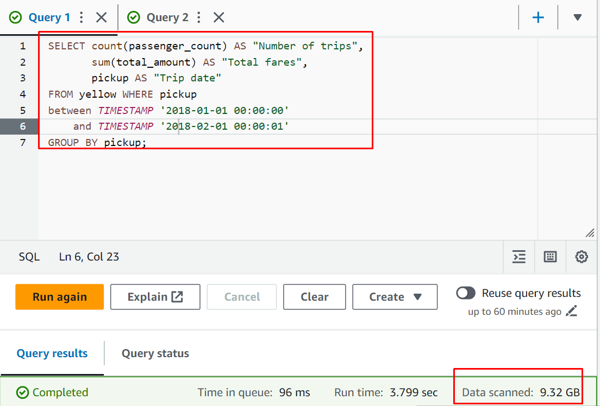
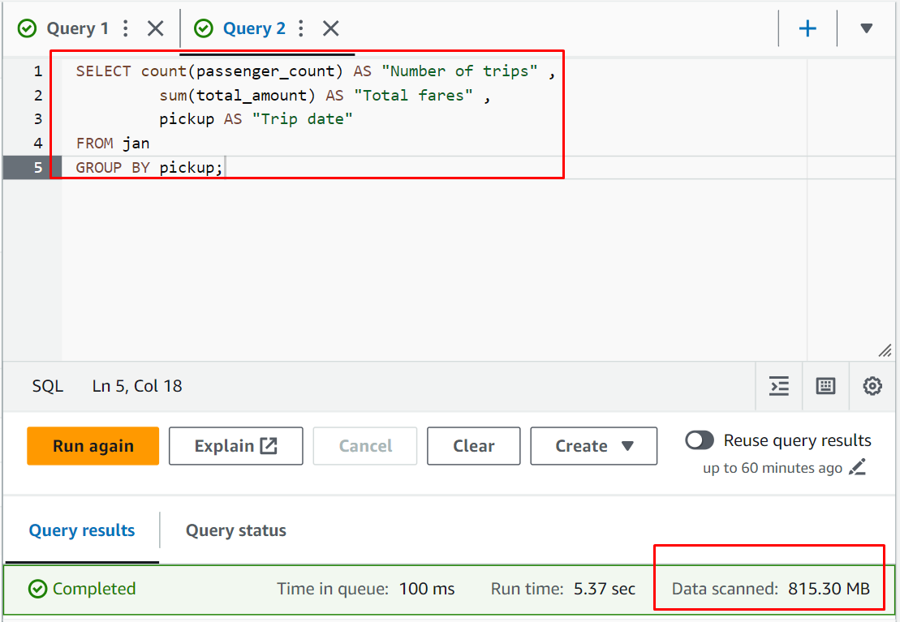

<div style="page-break-after: always; break-after: page;"></div>

## TASK 1: EXPLORE NEW YORK CITY TAXI TRIP DATA

> 1. Navigate to the TLC Trip Record Data website. The taxi commission publishes data on four types of cabs. Which are they?

For each years since 2019, the taxi commission published the data on the following four types of cabs :

- Yellow Taxi Trip Records
- Green Taxi Trip Records
- For-Hire Vehicle Trip Records
- High Volume For-Hire Vehicle Trip Records


> 2. Find the PDF file with the *data dictionary* for the yellow cab data on web site. Does it contain the data types?

The [Data Dictionary - Yellow Taxi Trip Records](https://www.nyc.gov/assets/tlc/downloads/pdf/data_dictionary_trip_records_yellow.pdf) contains a table with the field names and a description. The description helps to understand the data, but doesn't explicitly include the data types.


> 3. The yellow cab data is available in what types of files?

As of 13.05.2022, the taxi commissions have switched to the PARQUET file type for storing raw trip data on their website. This format is the industry standard for working with big data and allows for reduced file sizes and increased speed.


> 4. Find the copy of the data product in the Registry of Open Data on AWS. What is the bucket name? In which region is the bucket? Open the bucket in the S3 console.

The data product is named [New York City Taxi and Limousine Commission (TLC) Trip Record Data](https://registry.opendata.aws/nyc-tlc-trip-records-pds/) in the Registry of Open Data on AWS. The data are stored in the `nyc-tlc` bucket, wich is hosted in the `us-east-1` AWS Region.

The bucket can be accessed via this link : https://us-east-1.console.aws.amazon.com/s3/buckets/nyc-tlc?region=us-east-1&bucketType=general&tab=objects


> 5. In this lab we are going to use the yellow cab trip data.
>    In which folder are the CSV files for yellow cabs? Does this folder only contain yellow cab data?
>    In which folder are the Parquet files for yellow cabs? Does this folder only contain yellow cab data?

The CSV files for yellow cab are located under the prefix [opendata_repo/opendata_webconvert/yellow/](https://us-east-1.console.aws.amazon.com/s3/buckets/nyc-tlc?region=us-east-1&bucketType=general&prefix=opendata_repo/opendata_webconvert/yellow/&showversions=false) for the year 2022 and under the prefix [csv_backup/](https://us-east-1.console.aws.amazon.com/s3/buckets/nyc-tlc?region=us-east-1&bucketType=general&prefix=csv_backup/&showversions=false) for the older versions. Note that there are two files appear in both paths.


> 6. Is Amazon's copy up-to-date compared to the original data product?

The Amazon copy is not up to date. The latest version of the file (CSV and Parquet) is from December 2022. The TLC Trip Record Data website has data through February 2024. Note that the Taxi publishes trip data monthly (with a two month delay).


## TASK 3: OPTIMISE THE QUERY BY SCANNING ONLY A PARTITION OF THE DATA

DDL definition of the table:
```text
CREATE EXTERNAL TABLE IF NOT EXISTS `taxidata_grj`.`jan` (
  `vendorid` int,
  `pickup` timestamp,
  `dropoff` timestamp,
  `passenger_count` float,
  `trip_distance` float,
  `ratecodeid` float,
  `store_and_fwd_flag` string,
  `pulocationid` int,
  `dolocationid` int,
  `payment_type` int,
  `fare_amount` float,
  `extra` float,
  `mta_tax` float,
  `tip_amount` float,
  `tolls_amount` float,
  `improvement_surcharge` float,
  `total_amount` float,
  `congestion_surcharge` float,
  `airport_fee` float
)
ROW FORMAT SERDE 'org.apache.hadoop.hive.serde2.lazy.LazySimpleSerDe'
WITH SERDEPROPERTIES ('field.delim' = ',')
STORED AS INPUTFORMAT 'org.apache.hadoop.mapred.TextInputFormat' OUTPUTFORMAT 'org.apache.hadoop.hive.ql.io.HiveIgnoreKeyTextOutputFormat'
LOCATION 's3://aws-tc-largeobjects/CUR-TF-200-ACBDFO-1/Lab2/January2017/'
TBLPROPERTIES ('classification' = 'csv');

```


We have seen that the first request is way more expensive for extracting the data of January. In this request we are going through the whole year and we apply the condition on the TIMESTAMP. We see we have to parse 9.32 GB of data.



In the second request we are going through January only performing a GROUP BY. In this case we parse only 815.30 MB of data.



> Deliverables:
> In the Athena console display the DDL definition of the table and copy it into the report.


## TASK 5: EXPLORE AND TRANSFORM DATA WITH GLUE DATABREW

>Deliverables:
>Show the schema of the generated Parquet files in the report.
>Responses to questions.